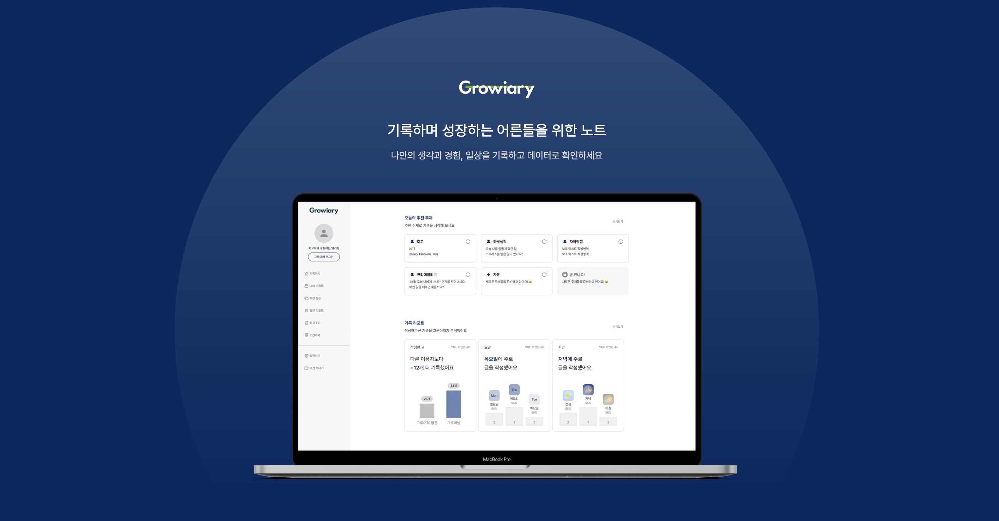

# Growiary 그루어리


<!-- &nbsp;&nbsp;&nbsp;&nbsp;&nbsp;[1.1](#11-주요-스택-사용-이유). 주요 스택 사용 이유   -->

## 목차

[1](#1-기술-스택). 기술 스택  
[2](#2-설치-및-실행). 설치 및 실행  
[3](#3-팀원-구성). 팀원 구성  
[4](#4-협업-방식). 협업 방식  
[5](#5-페이지별-기능). 페이지별 기능  
&nbsp;&nbsp;&nbsp;&nbsp;&nbsp;[5.1](#51-랜딩-페이지). 랜딩 페이지  
&nbsp;&nbsp;&nbsp;&nbsp;&nbsp;[5.2](#52-메인-페이지). 메인 페이지  
&nbsp;&nbsp;&nbsp;&nbsp;&nbsp;[5.3](#53-기록-작성). 기록 작성  
&nbsp;&nbsp;&nbsp;&nbsp;&nbsp;[5.4](#54-나의-기록들). 나의 기록들  
&nbsp;&nbsp;&nbsp;&nbsp;&nbsp;[5.5](#55-추천-주제). 추천 주제  
&nbsp;&nbsp;&nbsp;&nbsp;&nbsp;[5.6](#56-기록-데이터-보기). 기록 데이터 보기  
&nbsp;&nbsp;&nbsp;&nbsp;&nbsp;[5.7](#57-도전과제). 도전과제  
&nbsp;&nbsp;&nbsp;&nbsp;&nbsp;[5.8](#58-설정하기-의견보내기). 설정하기 & 의견보내기  

[6](#6-주요-도전-과제). 주요 도전 과제    
&nbsp;&nbsp;&nbsp;&nbsp;&nbsp;[6.1](#61-tanstack-query). Tanstack Query  
&nbsp;&nbsp;&nbsp;&nbsp;&nbsp;[6.2](#62-사용자-상태-별-데이터-처리). 사용자 상태 별 데이터 처리  
&nbsp;&nbsp;&nbsp;&nbsp;&nbsp;[6.3](#63-oauth-로그인). OAuth 로그인  
&nbsp;&nbsp;&nbsp;&nbsp;&nbsp;[6.4](#64-react-hook-form--zod). React-Hook-Form & Zod  
&nbsp;&nbsp;&nbsp;&nbsp;&nbsp;[6.5](#65-web-push-fcm). Web Push(FCM)  
[7](#7-리팩토링). 리팩토링

## 1. 기술 스택

| **Frontend**       | **Backend**        | **Collaboration** |
| ------------------ | ------------------ | ----------------- |
| Nexjs (App Router) | Nest.js            | Figma             |
| Typescript         | OpenAi API         | Notion            |
| Tailwind           | Firebase Functions | Slack             |
| Tanstack Query     | Firebase Firestore | GitHub            |
| Recoil             |                    |                   |
| Vercel             |                    |                   |

## 2. 설치 및 실행

```
npm install && npm run dev
```

※ .env 파일이 별도로 필요합니다.

## 3. 팀원 구성

| **이름** | **역할**        |
| -------- | --------------- |
| 배건우   | 운영, 마케팅    |
| 임효인   | 기획            |
| 윤동현   | 디자인          |
| 강은영   | 프론트엔드 개발 |
| 이병민   | 백엔드 개발     |

※ 개인 정보 보호를 위해 연락처 및 이메일은 기재하지 않았습니다.

## 4. 협업 방식

 GitHub: 코드 관리</div>

 Notion: 데일리스크럼, 팀 회의, 주요 자료 기록, 이슈 관리

## 5. 페이지별 기능

### 5.1. 랜딩 페이지
- 비로그인 사용자가 메인 페이지 접근 시 자동 리다이렉트되는 소개 페이지

### 5.2. 메인 페이지
- 사용자 상태에 따라 맞춤형 정보(기록 요약, 추천 주제 등)를 제공  
- 카테고리별 추천 주제 확인 및 다른 주제로 전환 가능

### 5.3. 기록 작성
- 주제 선택 후 템플릿 기반으로 글 작성 가능  
- 비로그인 사용자도 임시 저장 후 로그인 시 데이터 유지  
- 입력 조건(제목, 카테고리, 내용 10자 이상) 충족 시 저장 가능

### 5.4. 나의 기록들
- 월별 작성 데이터 및 카테고리별 기록 확인  
- 달력에서 특정 일자 클릭 시 해당 날짜 기록으로 이동

### 5.5. 추천 주제
- 주간 인기, 카테고리별, 최근 작성 주제 등 다양한 기준으로 추천 제공

### 5.6. 기록 데이터 보기
- 기록 글 수, 글자 수, 작성 시간대, 카테고리 등 다양한 분석 지표 시각화  
- 전체 사용자 및 과거 나와의 비교를 통해 기록 패턴 인식 지원

### 5.7. 도전과제
- 글쓰기 루틴과 연동된 뱃지 시스템 제공  
- 현재 타이틀 및 획득한 뱃지를 확인하고 설정 가능

### 5.8. 설정하기 & 의견 보내기
- 서비스 이용약관, 개인정보 처리방침, 계정 정보 확인  
- 서비스 관련 의견 제출 가능 (푸터에서도 접근 가능)

## 6. 주요 도전 과제

### 6.1. Tanstack Query

### 6.2. 사용자 상태 별 데이터 처리

### 6.3. OAuth 로그인

### 6.4. React-Hook-Form & Zod

### 6.5. Web Push (FCM)

## 7. 리팩토링

<!-- # 폴더 구조

```text
src
|_apis             // api 요청
|_app
|_components
|   |_providers
|   |_ ui          // installed shadcn component
|_hooks            // custom hooks
|_lib
|_store            // recoil
|_utils            // 공통 함수
|_views            // 화면 UI
|   |_ common      // 공통 화면 UI
```₩

# 관리자 페이지

```text
src
|_app
|   |_admin
|_views
|   |_admin
```

## Shadcn 기본 컴포넌트에 추가된 컴포넌트

- button.tsx
  - ButtonIcon
- alert-dialog.tsx
  - AlertDialogTitleIcon

## 라이브러리 정보

[tailwind](https://tailwindcss.com/)

[shadcn/ui](https://ui.shadcn.com/)

[아이콘](https://lucide.dev/) -->
